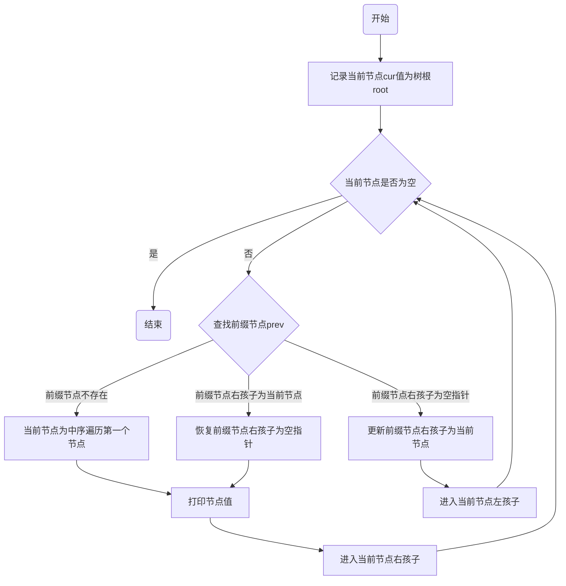

# 恢复二叉搜索树

## 题目解析

所谓二叉搜索树，即对于任意一个节点，其所有的左孩子小于自身，所有的右孩子大于自身。所以如果将二叉树中序遍历，可以得到一个升序数组。

所谓错误的二叉树，其实就是将这个升序数组中的两个位置对调，根据位置索引不同，有以下集中可能的结果：

1. 交换位置相邻，升序数组中出现一次降序。
2. 交换位置不相邻，升序数组中出现两次降序。

无论哪一种情况，总结可以发现，被交换的两个位置分别满足：

1. 数据中第一次降序，该索引位置后驱小于自身。
2. 数据中最后一次降序，该索引位置前驱大于自身。

所以可以使用中序遍历从前往后找到`１`号位置，逆中序(即先访问右孩子)从后往前找到`２`号位置，然后交换两个位置数据，最终恢复二叉搜索树。

## Morris算法

这道题的题解资料提供了另一种非递归且空间复杂度为O(1)的Morris算法，对这个算法虽然有一些疑问，但在某些应用场景下还是有所作用的，因此记录下来。

算法理解不难，复用树中冗余的空指针空间，达到空间复杂度的目的，完成树的中序遍历。算法流程图如下：

找到前缀节点，将其右孩子更新为当前节点，这样能保证遍历到前缀节点时，进入前缀右孩子可以回到当前节点。

然后进入左子树，此时树的最右节点(即上一个前缀节点)的右孩子指向了当前树的父亲节点。这样当该树遍历完毕时，进入右孩子必然又会进入父亲节点。

所以如果前缀节点右孩子为当前节点，说明其左子树已经遍历完成，需要将右孩子恢复空指针，不影响原树的数据结构。

## 思考

使用Morris算法，每个有左子树的节点都需要查找两次其前缀节点，先后更新以及恢复其前缀节点右孩子。

而且当我们找到目标节点时，如果想要中断算法，必须先将树中已经更新过的右孩子节点恢复。

回到此题，使用一次全遍历，整体运行时间并没右显著提升，有时间尝试使用逆序Morris再试试看。